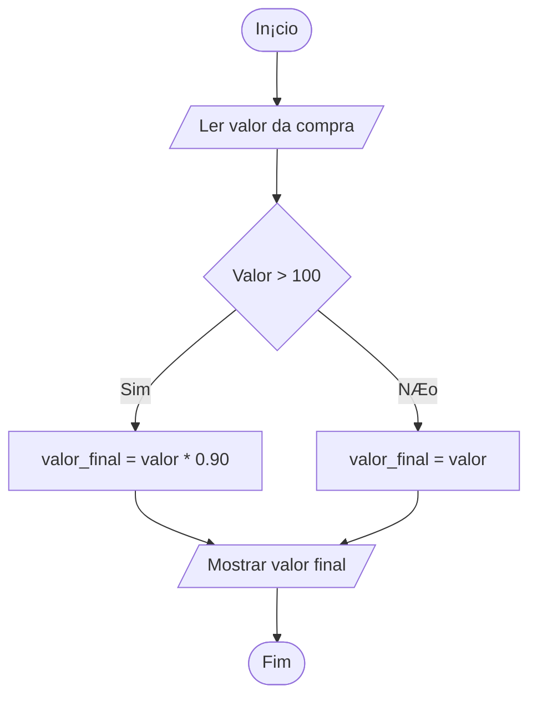

# FLuxograma

:computer: Programa START DEV - TOTVS Paulista.

```mermaid
graph TD
  A([In¡cio]) --> B[/Ler valor da compra/];
  B --> C{Valor > 100};
  C -- Sim --> D[valor_final = valor * 0.90];
  C -- NÆo --> E[valor_final = valor];
  D --> F[/Mostrar valor final/];
  E --> F;
  F --> G([Fim]);
```