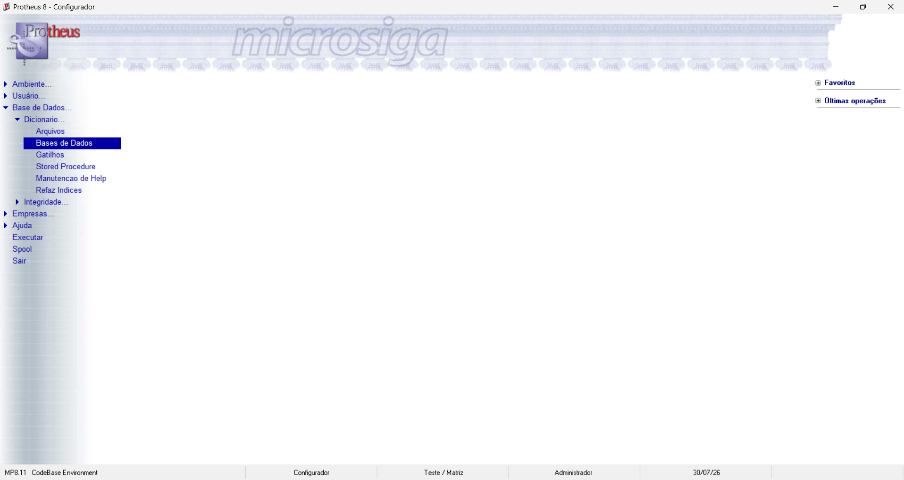
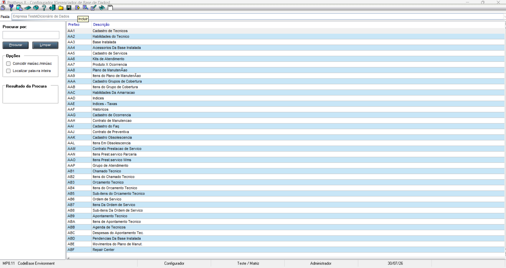
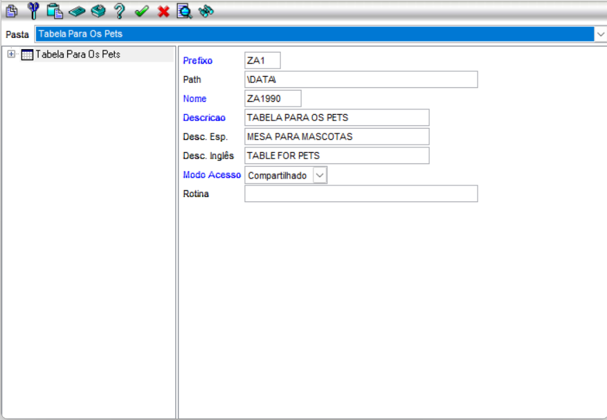
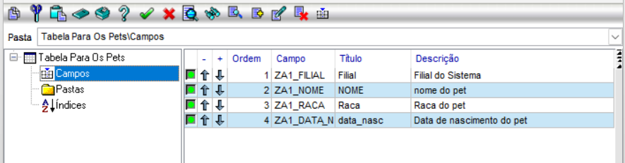
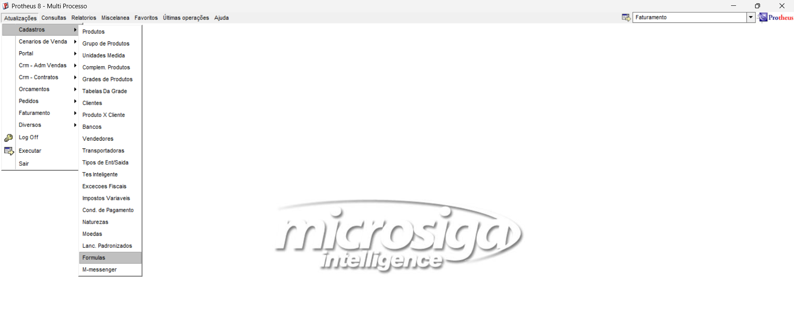
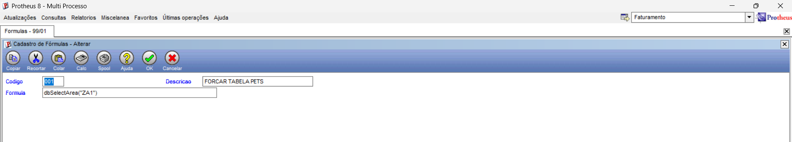
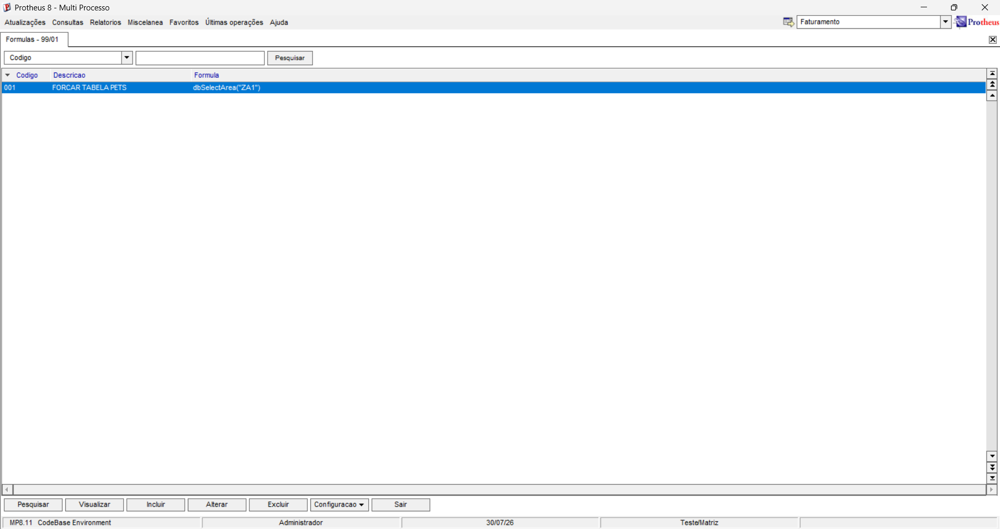
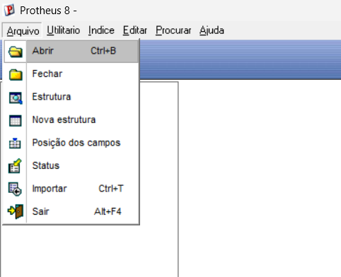
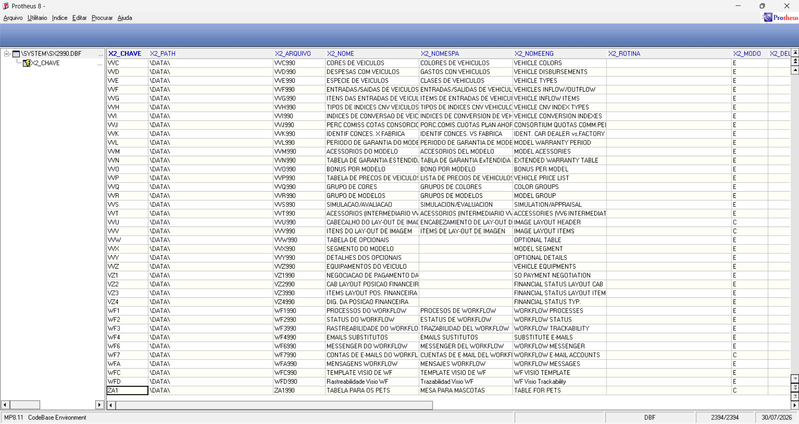
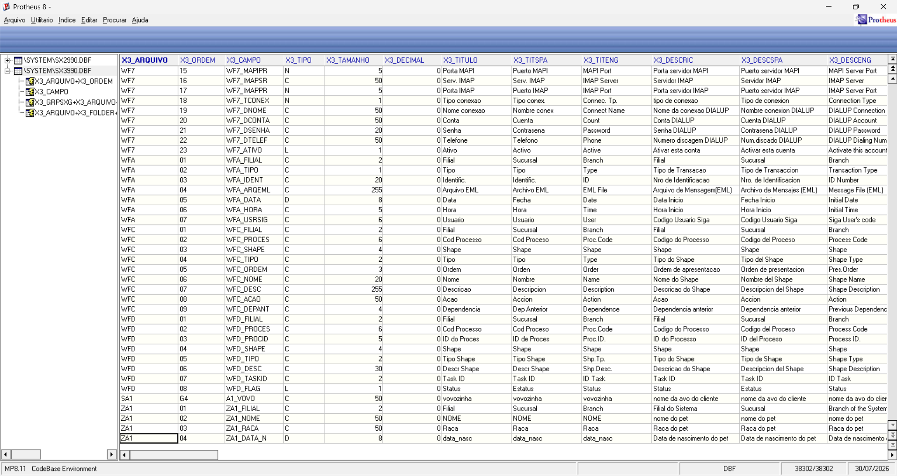

# Recriando ZA1 no Configurador

## a. Cadastre a estrutura no dicionário(SX2/SX3)

ex03-configurador.jpg: A imagem exibe a tela inicial do módulo Configurador do Protheus 8. O menu lateral esquerdo apresenta o caminho navegado: "Base de Dados" > "Dicionario" > "Bases de Dados", com esta última opção destacada.

ex03-criando-za1.png: A tela "Gerenciador de Base de Dados" é exibida listando as tabelas do sistema em ordem alfabética. O cursor do mouse está posicionado sobre o botão "Incluir" no menu superior, indicando a ação de adicionar um novo registro de tabela.

ex03-preenchimento-dos-campos-za1.png: A janela de propriedades da nova tabela está aberta. Os campos foram preenchidos da seguinte maneira: Prefixo com "ZA1", Path com "\DATA", Nome com "ZA1990", Descricao com "TABELA PARA OS PETS", Desc. Esp. com "MESA PARA MASCOTAS", Desc. Inglês com "TABLE FOR PETS" e Modo Acesso definido como "Compartilhado".

ex03-campos-preenchidos.png: A interface mostra a estrutura interna da tabela "Tabela Para Os Pets". Na seção de campos, quatro registros foram criados e ordenados: "ZA1_FILIAL" (Filial), "ZA1_NOME" (NOME), "ZA1_RACA" (Raca) e "ZA1_DATA_N" (data_nasc).

## b. Force o reconhecimento da tabela pelo framework (rotina de fórmula, como foi mostrado em aula).

ex03-sigamdi.png: O texto em marca d'água no centro da tela diz "microsiga Intelligence". A imagem exibe o menu do módulo "Multi Processo" do Protheus 8. O menu superior "Atualizações" está aberto, revelando a lista de "Cadastros" e, ao final da cascata de opções, o item "Formulas" está selecionado.

ex03-forcando-reconhecimento.png: A tela "Cadastro de Fórmulas - Alterar" está em exibição. O campo "Codigo" está preenchido com "001", a "Descricao" contém o texto "FORCAR TABELA PETS" e o campo "Formula" contém o comando ADVPL dbSelectArea("ZA1").

ex03-formula-executada.png: O browse da rotina de Fórmulas é apresentado. A fórmula recém-criada, de código "001" e descrição "FORCAR TABELA PETS", aparece salva e selecionada na grade de dados.

## c. Confira a estrutura final no MPSDU.

ex03-MPSDU.png: A imagem mostra a barra de ferramentas do utilitário MPSDU do Protheus 8. O menu suspenso "Arquivo" está aberto e a primeira opção encontra-se selecionada pelo cursor.

ex03-SX2.jpg: A tabela de sistema SX2990.DBF está aberta e seu conteúdo é listado na tela. A última linha em destaque na tabela comprova a criação física do registro para a nova tabela, contendo as informações "ZA1", "ZA1990" e "TABELA PARA OS PETS".

ex03-SX3.jpg: A tabela de dicionário de campos SX3990.DBF está em exibição. As quatro últimas linhas da grade exibem o registro físico dos campos recém-criados no dicionário de dados (ZA1_FILIAL, ZA1_NOME, ZA1_RACA e ZA1_DATA_N)

