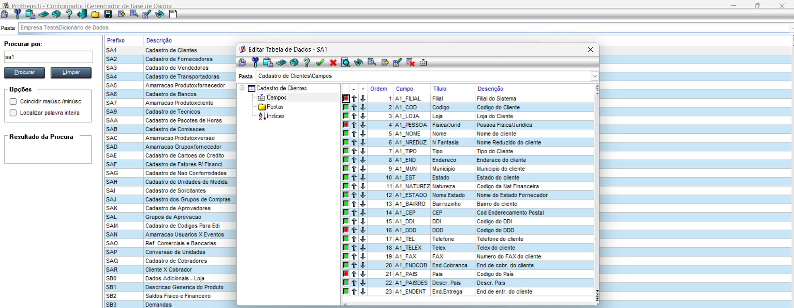
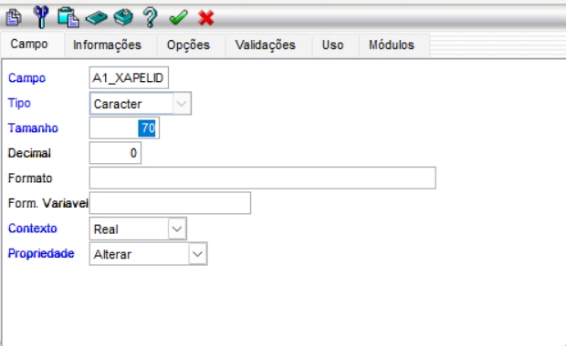
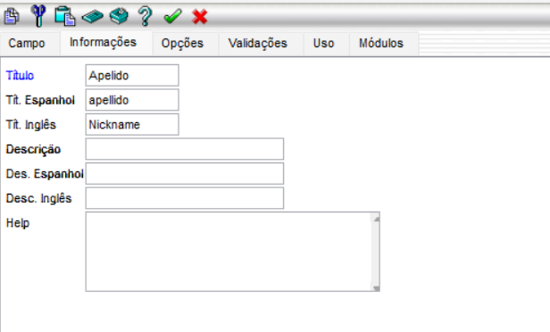
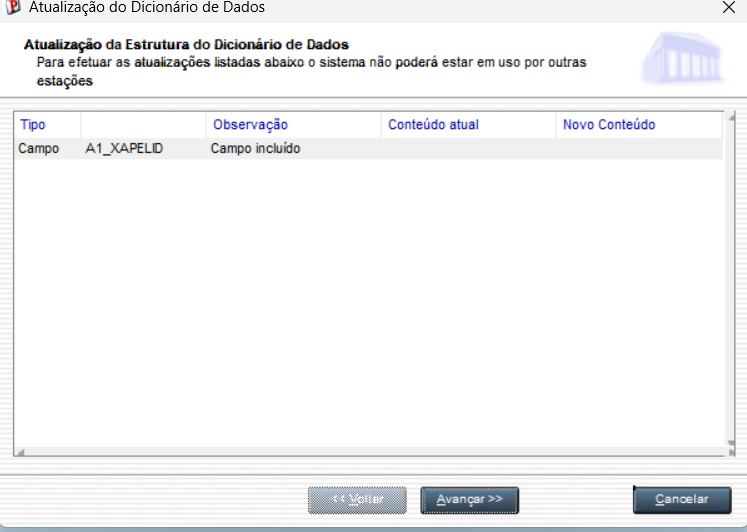
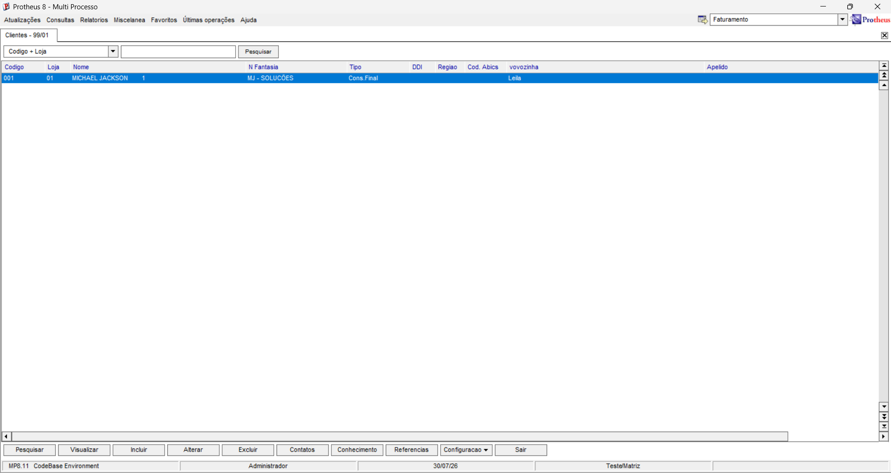

# Campo da tabela de clientes SA1 customizado

## a. Defina tipo, tamanho e t¡tulo do campo no Configurador.

## b. Volte ao SmartClient e mostre que o campo aparece na tela ? sem escrever nenhuma linha de c¢digo.

