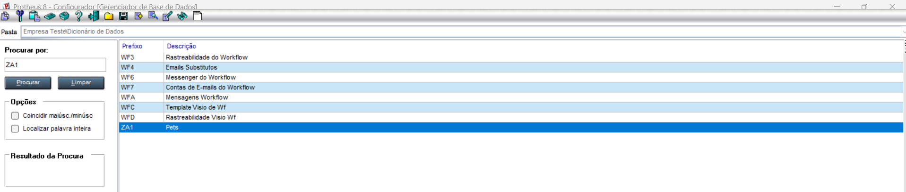
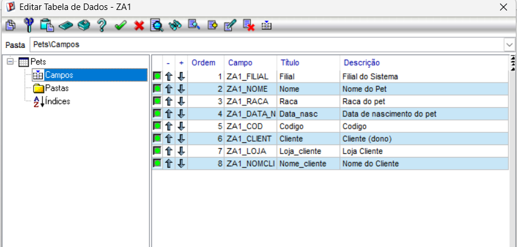
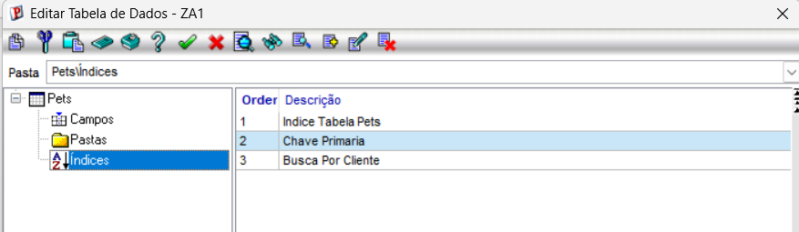

# Exercício 2 — Completando a tabela ZA1

## SX2

- Acessando o SIGACFG, nas configurações das bases de dados, especificamente no Dicionário de Dados, pesquisei e encontrei ZA1, a tabela responsável pelo cadastramento dos pets dos clientes.

---

## SX3

-  Após encontrar ZA1, selecionei e editei a tabela para adicionar os novos campos solicitados no módulo 08.

---

## SIX

- Ainda no visualizador da tabela, cliquei em "Índices" e criei dois novos índices: chave primária(ZA1_FILIAL + ZA1_COD) e busca por cliente(ZA1_FILIAL + ZA1_ CLIENT + ZA1_LOJA)

